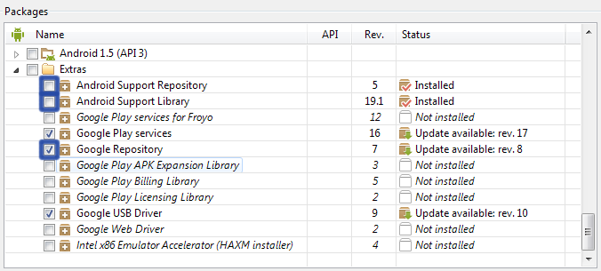

# Scala on Android

Writing your Android project in [Scala](http://scala-lang.org/) is becoming smoother and smoother.
This is a short guide that will help you get started.

## The Android SDK

The SDK can be downloaded from the [Android website](http://developer.android.com/sdk/index.html).
You will also need to configure `ANDROID_SDK_HOME` environment variable to point to the installation.

To use the bundled libraries, such as the support library, make sure you install the following items in the SDK manager:

## The build system

The most important part of the equation is the build system (even in mainland Android your are likely to use one anyway).
After configuring the build you will be able to compile and *run the project from the command line* and *generate IDE project
files automatically*.

Scala uses a build system called [sbt](http://www.scala-sbt.org/), which you’ll have to install from its website.
To compile and run Android projects you will need one of the two available plugins:

* https://github.com/jberkel/android-plugin, which is older and almost unmaintained, but has a [fancier guide](http://fxthomas.github.io/android-plugin/); or
* https://github.com/pfn/android-sdk-plugin, which is newer and actively maintained, still provides a [guide](https://github.com/pfn/android-sdk-plugin#usage) and even a few [example projects](https://github.com/pfn/android-sdk-plugin/tree/master/sbt-test/android-sdk-plugin). *I would recommend this one*.

Proceed to the respective guides to learn how to set things up.

## The IDE

The recommended IDE is [Intellij IDEA](http://www.jetbrains.com/idea/) or
[Android Studio](http://developer.android.com/sdk/installing/studio.html), which is actually the same.
You will need to have the [Scala](http://plugins.jetbrains.com/plugin/?id=1347)
and [sbt](http://plugins.jetbrains.com/plugin/5007?pr=idea) plugins installed.

Once you have the build running from the command line, follow the instructions for your sbt plugin to
create IDE project files.

Inside IDEA, you can use the sbt console to run the project. Alternatively, the “run” button could
be reconfigured for that purpose: go to Run → Edit Configurations →
(select a configuration) → Before launch → (click +) → SBT → (type `android:run` or `android:start`,
depending on the plugin you use).

## Alternative approaches

* Both Intellij IDEA / Android Studio and Scala IDE for Eclipse can be used without a build system.
In case of Scala IDE, the [AndroidProguardScala plugin](https://github.com/banshee/AndroidProguardScala) is
necessary. This approach however is not recommended, as it lacks automatic dependency management and
is tied to a particular IDE.

* [Gradle](http://www.gradle.org/), the now-standard Android build system, can be used as well. You will
need [gradle-android-scala-plugin](https://github.com/saturday06/gradle-android-scala-plugin).

## Useful resources

* When in doubt, don’t hesitate to use the [Scala-on-Android mailing list](https://groups.google.com/forum/#!forum/scala-on-android).
* See the [talks](Talks.html) section, as I also cover the matter in those talks.